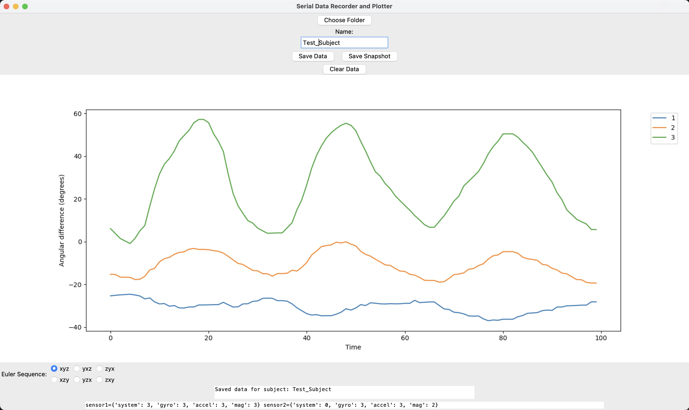

# 3D-motion_registration-tools

The 3D-motion_registration-tools repository is a collection of Python scripts and utilities for registering and analyzing biomechanical movements in real time. The goal of this project is to provide a flexible and user-friendly tool that displays the location and orientation of motion sensors, allowing researchers to track and verify the success of motion registration during recording.

## Features

- Real-time visualization of motion sensor data in a graphical user interface (GUI)
- Support for reading data from serial ports or named pipes from various motion registration tools
- Interactive GUI for selecting rotation sequences and observing their influence on the plot
- Data storage in CSV format for further analysis

## Key Advantages

- **Real-time Rotation Sequence Selection**: The GUI allows users to choose the rotation sequence in real time. This feature enables researchers to immediately see the influence of different sequences on the plot, helping them choose the most suitable sequence for their specific needs.

## Compatibility

The project currently includes the following scripts and drivers:

- `Project_IMU.py`: Python script for reading data from IMU sensors and displaying it in the GUI.
- `Project_Liberty.py`: Python script for reading data from Polhemus Liberty sensors and displaying it in the GUI.
- Driver for the Polhemus Liberty system, providing the necessary communication and data retrieval functionalities. For now only works with Linux. 

The development of the project is ongoing, with the goal of adding support for other motion registration tools in the future. Additionally, efforts are being made to enhance the tool's user-friendliness and intuitiveness. Aswell as getting the driver to work on macOS.

## Installation

1. Clone the repository to your local machine:

   ```shell
   git clone https://github.com/your-username/3D-motion_registration-tools.git
   ```

2. Install the required dependencies.

3. When using the Polhemus Liberty also install firmware and compile driver (only available for Linux)


## Usage

1. Choose the appropriate script (`Project_IMU.py` or `Project_Liberty.py`) based on your motion registration tool.

2. Adjust the python script to connect your motion tracking device to the appropriate serial port or set up the named pipe communication.

3. Run the selected script:

4. If communication is successfull, the GUI window will appear, providing various options for data recording and visualization.

5. Choose a folder for data storage by clicking the "Select Folder" button.

6. Specify a subject name in the corresponding text box.

7. Use the GUI controls to save data, save snapshots, clear recorded data, and choose an Euler sequence for angle calculations.

8. When you are ready to start a motion recording, use the clear data button to wipe the data and have a fresh registror

9. Start your motion, and the motion sensor data will be displayed in real time on the plot.

10. Monitor the success of motion registration by observing the plot and the calculated angular differences.

11. Once the recording is complete, click the "Save Data" button to store the recorded data in a CSV file.

12. If you only want a snapshot of the currant position of the sensors, use the "Save snapshot" button.




## Project Structure

The repository contains the following files:

- `Project_IMU.py`: Python script for reading data from IMU sensors and displaying it in the GUI.
- `Project_Liberty.py`: Python script for reading data from Polhemus Liberty sensors and displaying it in the GUI.

- Within the Project Liberty there is also a Driver for the Polhemus Liberty system, providing the necessary communication and data retrieval functionalities. For now the Polhemus driver only works on Linux. Follow the instuctions provided there.

## License

This project is licensed under the [MIT License](LICENSE). Feel free to use and modify the code according to your needs.

## Acknowledgments

The driver has been derived from documentation from Polhemus, available in the Liberty Manual.
